# Horizop Energy Connect - Use Case Diagram

```mermaid
graph TB
    %% Actors
    Customer((Customer))
    Partner((Partner))
    Installer((Installer))
    Distributor((Distributor))
    Financial((Financial Customer))
    Admin((Admin))
    System((System))

    %% Use Cases - Customer
    subgraph "Customer Use Cases"
        UC1[Browse Products]
        UC2[View Product Details]
        UC3[Add to Cart]
        UC4[Manage Shopping Cart]
        UC5[Checkout]
        UC6[Track Orders]
        UC7[View Order History]
        UC8[Register Account]
        UC9[Login/Logout]
        UC10[Update Profile]
        UC11[Request Quote]
        UC12[Contact Support]
        UC13[View Charging Stations]
        UC14[Start Charging Session]
        UC15[View Charging History]
        UC16[Download Mobile App]
        UC17[Switch Language]
        UC18[View Training Materials]
    end

    %% Use Cases - Partner
    subgraph "Partner Use Cases"
        UC19[Partner Registration]
        UC20[Manage Partner Profile]
        UC21[View Partner Orders]
        UC22[Manage Charging Stations]
        UC23[View Commission Reports]
        UC24[Access Partner Portal]
        UC25[Manage Installations]
    end

    %% Use Cases - Installer
    subgraph "Installer Use Cases"
        UC26[Installer Registration]
        UC27[Manage Installer Profile]
        UC28[View Installation Requests]
        UC29[Schedule Installations]
        UC30[Update Installation Status]
        UC31[View Installation History]
    end

    %% Use Cases - Distributor
    subgraph "Distributor Use Cases"
        UC32[Distributor Registration]
        UC33[Manage Distributor Profile]
        UC34[View Product Inventory]
        UC35[Manage Sales Reports]
        UC36[View Client Information]
    end

    %% Use Cases - Financial
    subgraph "Financial Customer Use Cases"
        UC37[Financial Registration]
        UC38[Submit Investment Interest]
        UC39[View Investment Opportunities]
        UC40[Contact Financial Team]
    end

    %% Use Cases - Admin
    subgraph "Admin Use Cases"
        UC41[Manage Users]
        UC42[Manage Products]
        UC43[Manage Orders]
        UC44[Approve Partners]
        UC45[Manage Charging Infrastructure]
        UC46[View System Analytics]
        UC47[Manage Support Tickets]
        UC48[Send Notifications]
    end

    %% Use Cases - System
    subgraph "System Use Cases"
        UC49[Process Payments]
        UC50[Send Email Notifications]
        UC51[Send SMS Notifications]
        UC52[Generate Reports]
        UC53[Handle Payment Webhooks]
        UC54[Process Charging Sessions]
        UC55[Monitor System Health]
    end

    %% Customer Relationships
    Customer --> UC1
    Customer --> UC2
    Customer --> UC3
    Customer --> UC4
    Customer --> UC5
    Customer --> UC6
    Customer --> UC7
    Customer --> UC8
    Customer --> UC9
    Customer --> UC10
    Customer --> UC11
    Customer --> UC12
    Customer --> UC13
    Customer --> UC14
    Customer --> UC15
    Customer --> UC16
    Customer --> UC17
    Customer --> UC18

    %% Partner Relationships
    Partner --> UC19
    Partner --> UC20
    Partner --> UC21
    Partner --> UC22
    Partner --> UC23
    Partner --> UC24
    Partner --> UC25

    %% Installer Relationships
    Installer --> UC26
    Installer --> UC27
    Installer --> UC28
    Installer --> UC29
    Installer --> UC30
    Installer --> UC31

    %% Distributor Relationships
    Distributor --> UC32
    Distributor --> UC33
    Distributor --> UC34
    Distributor --> UC35
    Distributor --> UC36

    %% Financial Customer Relationships
    Financial --> UC37
    Financial --> UC38
    Financial --> UC39
    Financial --> UC40

    %% Admin Relationships
    Admin --> UC41
    Admin --> UC42
    Admin --> UC43
    Admin --> UC44
    Admin --> UC45
    Admin --> UC46
    Admin --> UC47
    Admin --> UC48

    %% System Relationships
    System --> UC49
    System --> UC50
    System --> UC51
    System --> UC52
    System --> UC53
    System --> UC54
    System --> UC55

    %% Include Relationships
    UC5 -.-> UC49
    UC14 -.-> UC54
    UC25 -.-> UC30
    UC48 -.-> UC50
    UC48 -.-> UC51

    %% Extend Relationships
    UC5 -.-> UC6
    UC14 -.-> UC15
    UC28 -.-> UC30
    UC43 -.-> UC52

    %% Generalization
    Partner -.-> Customer
    Installer -.-> Customer
    Distributor -.-> Customer
    Financial -.-> Customer
```

## Use Case Descriptions

### Customer Use Cases
- **Browse Products**: View available EV charging products and accessories
- **View Product Details**: See detailed specifications, pricing, and features
- **Add to Cart**: Add products to shopping cart
- **Manage Shopping Cart**: Update quantities, remove items, view cart
- **Checkout**: Complete purchase with payment and shipping information
- **Track Orders**: Monitor order status and delivery progress
- **View Order History**: Access past orders and invoices
- **Register Account**: Create new customer account
- **Login/Logout**: Authenticate and manage session
- **Update Profile**: Modify personal information and preferences
- **Request Quote**: Submit custom quote requests for installations
- **Contact Support**: Create support tickets and get help
- **View Charging Stations**: Find nearby charging infrastructure
- **Start Charging Session**: Initiate charging at stations
- **View Charging History**: Track past charging sessions and costs
- **Download Mobile App**: Access mobile application
- **Switch Language**: Change interface language (multi-language support)
- **View Training Materials**: Access educational content

### Partner Use Cases
- **Partner Registration**: Apply to become a business partner
- **Manage Partner Profile**: Update company information and services
- **View Partner Orders**: Track orders placed through partner network
- **Manage Charging Stations**: Operate and maintain charging infrastructure
- **View Commission Reports**: Access earnings and performance metrics
- **Access Partner Portal**: Use specialized partner interface
- **Manage Installations**: Coordinate installation services

### Installer Use Cases
- **Installer Registration**: Apply to become certified installer
- **Manage Installer Profile**: Update certifications and availability
- **View Installation Requests**: Access customer installation requests
- **Schedule Installations**: Book and manage installation appointments
- **Update Installation Status**: Report progress and completion
- **View Installation History**: Track past installations

### Distributor Use Cases
- **Distributor Registration**: Apply to become product distributor
- **Manage Distributor Profile**: Update business information
- **View Product Inventory**: Access available products for distribution
- **Manage Sales Reports**: Track sales performance and metrics
- **View Client Information**: Access customer data for distribution

### Financial Customer Use Cases
- **Financial Registration**: Register for investment opportunities
- **Submit Investment Interest**: Express interest in financial partnerships
- **View Investment Opportunities**: Access investment information
- **Contact Financial Team**: Connect with financial advisors

### Admin Use Cases
- **Manage Users**: Oversee all user accounts and permissions
- **Manage Products**: Add, edit, and remove products from catalog
- **Manage Orders**: Process and track all system orders
- **Approve Partners**: Review and approve partner applications
- **Manage Charging Infrastructure**: Oversee charging station network
- **View System Analytics**: Access business intelligence and reports
- **Manage Support Tickets**: Handle customer support requests
- **Send Notifications**: Broadcast system-wide communications

### System Use Cases
- **Process Payments**: Handle payment processing and validation
- **Send Email Notifications**: Deliver email communications
- **Send SMS Notifications**: Deliver SMS communications
- **Generate Reports**: Create automated reports and analytics
- **Handle Payment Webhooks**: Process payment gateway callbacks
- **Process Charging Sessions**: Manage charging session lifecycle
- **Monitor System Health**: Track system performance and availability 